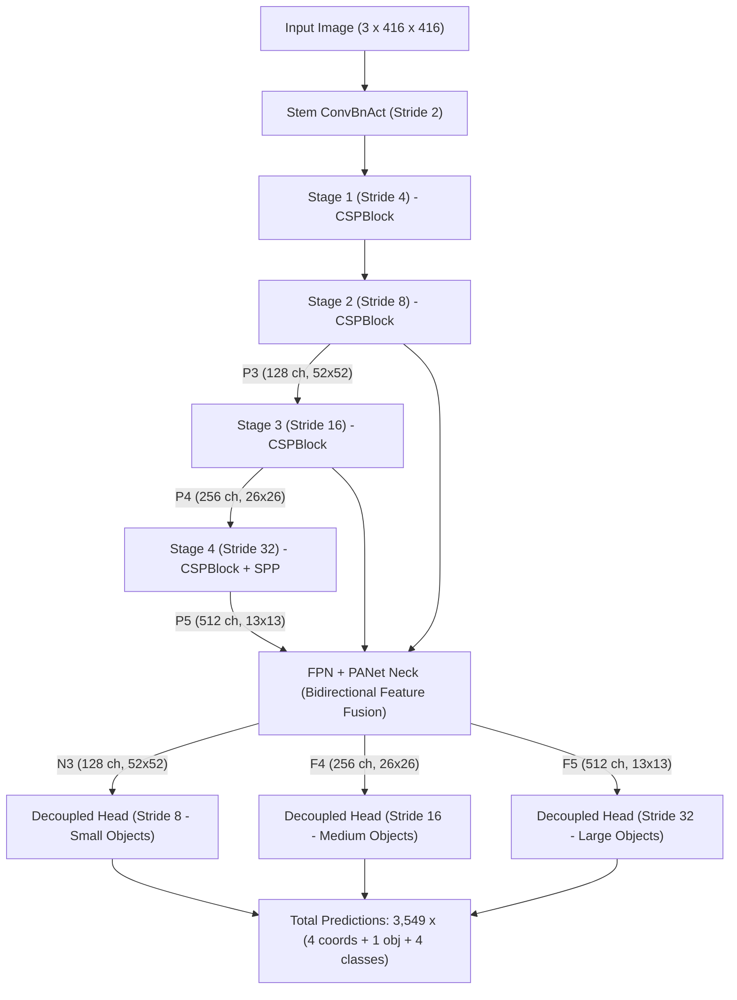

# ATMS-Net Vehicle Detector — Deep Learning Architecture & Model Specifications

This document provides a comprehensive technical specification of the **ATMS-Net Phase 1 Vehicle Detector** (`ATMSDetector`). It details the deep neural network architecture, layer hierarchy, channel/neuron distribution, activation functions, mathematical formulations, optimizer mechanics, and loss dynamics.

---

## 1. High-Level Model Overview

| Parameter | Specification |
| :--- | :--- |
| **Model Type** | Deep Convolutional Neural Network (Anchor-Free YOLO Detector) |
| **Total Parameters** | **13,173,691** (~13.2 Million weights) |
| **Trainable Parameters** | **13,173,691** (100% trainable from scratch) |
| **Model Size in Memory** | **50.3 MB** (FP32 uncompressed parameters) |
| **Input Image Resolution** | $416 \times 416 \times 3$ (RGB) |
| **Detection Strides** | $8, 16, 32$ (Small, Medium, Large scale detection) |
| **Target Vehicle Classes** | $4$ (`car`, `motorcycle`, `bus`, `truck`) |
| **Total Prediction Anchors/Cells** | **3,549 cells** per image ($52^2 + 26^2 + 13^2$) |

---

## 2. Deep Neural Network Architecture Hierarchy

The network follows a modular three-stage deep learning design:



---

## 3. Sub-Network Details & Layer Breakdown

### A. Backbone: CSP-Darknet (Cross-Stage Partial Network)
The backbone extracts multi-scale visual features from low-level edges up to high-level semantic concepts.

1. **Fundamental Building Unit — `ConvBnAct`**:
   - Composed of: $\text{Conv2d} \to \text{BatchNorm2d} \to \text{SiLU}$
   - Conv bias is omitted (`bias=False`) because BatchNorm maintains its own learnable bias.
2. **Residual Bottlenecks**:
   - $1\times1 \text{ Conv}$ (channel compression) $\to 3\times3 \text{ Conv}$ (spatial filtering) with residual identity skip connections ($y = x + \mathcal{F}(x)$).
3. **Cross-Stage Partial (CSP) Blocks**:
   - Splits input channels into two pathways:
     - **Path 1 (Computation Path)**: Passes through residual bottleneck chain.
     - **Path 2 (Gradient Bridge)**: Direct $1\times1 \text{ Conv}$ bypass.
   - Merged via concatenation and fused through a final $1\times1 \text{ Conv}$. Halves computational cost while maintaining gradient diversity.
4. **Spatial Pyramid Pooling (SPPBlock)**:
   - Evaluates parallel max-pooling across kernels $\{5\times5, 9\times9, 13\times13\}$.
   - Concatenates multi-scale pooling outputs to drastically enlarge the receptive field for vehicles near and far.

#### Layer Dimension Stages:
| Stage | Output Resolution | Output Channels | Operation |
| :--- | :--- | :--- | :--- |
| **Input** | $416 \times 416$ | $3$ | RGB image normalized to $[0, 1]$ |
| **Stem** | $208 \times 208$ | $32$ | $6\times6 \text{ Conv}, \text{stride}=2$ |
| **Stage 1** | $104 \times 104$ | $64$ | $3\times3 \text{ Conv}, \text{stride}=2$ + CSPBlock |
| **Stage 2 (P3)** | $52 \times 52$ | $128$ | $3\times3 \text{ Conv}, \text{stride}=2$ + CSPBlock |
| **Stage 3 (P4)** | $26 \times 26$ | $256$ | $3\times3 \text{ Conv}, \text{stride}=2$ + CSPBlock |
| **Stage 4 (P5)** | $13 \times 13$ | $512$ | $3\times3 \text{ Conv}, \text{stride}=2$ + CSPBlock + SPPBlock |

---

### B. Neck: FPN + PANet (Bidirectional Feature Fusion)
Combines high-resolution shallow spatial features with deep semantic representations.

1. **Top-Down Pathway (FPN)**:
   - Lateral $1\times1 \text{ Conv}$ on $P_5 \to 2\times$ nearest-neighbor upsample $\to \text{concat}(P_4) \to \text{CSP Block} \to N_4$.
   - Lateral $1\times1 \text{ Conv}$ on $N_4 \to 2\times$ nearest-neighbor upsample $\to \text{concat}(P_3) \to \text{CSP Block} \to N_3$.
2. **Bottom-Up Pathway (PANet)**:
   - $3\times3 \text{ Conv (stride 2)}$ on $N_3 \to \text{concat}(N_4) \to \text{CSP Block} \to F_4$.
   - $3\times3 \text{ Conv (stride 2)}$ on $F_4 \to \text{concat}(P_5) \to \text{CSP Block} \to F_5$.
3. **Outputs**:
   - $N_3$: $52 \times 52 \times 128$ (Stride 8 — high spatial resolution)
   - $F_4$: $26 \times 26 \times 256$ (Stride 16 — balanced)
   - $F_5$: $13 \times 13 \times 512$ (Stride 32 — strong semantics)

---

### C. Head: Multi-Scale Decoupled Detection Heads
A decoupled head separates class prediction from bounding box regression:

For each scale ($i \in \{8, 16, 32\}$):
```
                       ┌──> Cls Conv (2x 3x3 ConvBnAct) ──> 1x1 Conv ──> Class Logits (C=4)
Input Feature ──> Stem ┤
                       └──> Reg Conv (2x 3x3 ConvBnAct) ──┬──> 1x1 Conv ──> Box Offsets (4: x, y, w, h)
                                                          └──> 1x1 Conv ──> Objectness Logit (1)
```

- **Classification Branch**: 2 stacked $3\times3 \text{ ConvBnAct} \to 1\times1 \text{ Conv2d} \to 4 \text{ channels}$.
- **Regression Branch**: 2 stacked $3\times3 \text{ ConvBnAct} \to 1\times1 \text{ Conv2d} \to 4 \text{ channels}$.
- **Objectness Branch**: Shared features from regression branch $\to 1\times1 \text{ Conv2d} \to 1 \text{ channel}$.

---

## 4. Activation Functions & Output Formulations

### A. Hidden Layer Activations: SiLU (Swish)
All hidden convolutional blocks use **SiLU (Sigmoid Linear Unit)**:

$$\text{SiLU}(x) = x \cdot \sigma(x) = \frac{x}{1 + e^{-x}}$$

- **Why SiLU over ReLU?**
  1. **Smooth non-monotonic curve**: Has continuous 1st and 2nd derivatives.
  2. **Prevents dying neurons**: Retains a small negative gradient for $x < 0$, avoiding the permanent dead-neuron failure mode of ReLU.
  3. **Self-gating**: Scales inputs based on their own magnitude.

---

### B. Output Layer Activations (No Softmax)

The network **does NOT use Softmax**. It employs **Sigmoid ($\sigma$) and Exponential ($\exp$)** operations.

| Output Parameter | Activation Formula | Value Range | Interpretation |
| :--- | :--- | :--- | :--- |
| **Objectness ($obj$)** | $\sigma(z) = \frac{1}{1 + e^{-z}}$ | $[0, 1]$ | Probability that a bounding box exists |
| **Classification ($cls_c$)** | $\sigma(z_c) = \frac{1}{1 + e^{-z_c}}$ | $[0, 1]$ | Independent probability for each vehicle class $c$ |
| **Box Center ($x, y$)** | $2 \cdot \sigma(z) - 0.5 + \text{grid}$ | Local offset | Grid-relative coordinate scaled by stride |
| **Box Size ($w, h$)** | $\exp(\text{clamp}(z, -5, 5)) \cdot \text{stride}$ | $[e^{-5}\cdot s, e^{5}\cdot s]$ | Strictly positive width and height in pixels |

#### Why Sigmoid instead of Softmax?
1. **Multi-Label Independence**: Softmax assumes strict mutual exclusivity ($\sum P_i = 1$). Sigmoid evaluates classes independently, avoiding extreme penalization during multi-class overlap and providing calibrated confidence scores.
2. **Loss Compatibility**: Training uses `BCEWithLogitsLoss`, applying numerically stable log-sum-exp internally on raw logits $z$.

---

## 5. Loss Function Mathematical Specifications

The total training objective is a multi-task composite loss:

$$\mathcal{L}_{\text{total}} = \lambda_{\text{box}} \mathcal{L}_{\text{CIoU}} + \lambda_{\text{obj}} \mathcal{L}_{\text{obj}} + \lambda_{\text{cls}} \mathcal{L}_{\text{cls}}$$

Where $\lambda_{\text{box}} = 5.0$, $\lambda_{\text{obj}} = 1.0$, and $\lambda_{\text{cls}} = 1.0$.

### 1. Complete IoU (CIoU) Box Regression Loss
$$\mathcal{L}_{\text{CIoU}} = 1 - \text{IoU} + \frac{\rho^2(b, b^{gt})}{c^2} + \alpha v$$

- $\rho(b, b^{gt})$: Euclidean distance between predicted and ground-truth box center points.
- $c$: Diagonal length of the smallest enclosing box.
- $v = \frac{4}{\pi^2} \left( \arctan\frac{w^{gt}}{h^{gt}} - \arctan\frac{w}{h} \right)^2$: Aspect ratio consistency term.
- $\alpha = \frac{v}{(1 - \text{IoU}) + v}$: Dynamic weighting parameter.

### 2. Binary Cross-Entropy (BCE) for Objectness and Classification
$$\mathcal{L}_{\text{BCE}}(z, y) = - \left[ y \log \sigma(z) + (1 - y) \log (1 - \sigma(z)) \right]$$

---

## 6. Optimization, Scheduler & Hyperparameters

### A. Optimizer Mechanics
- **Algorithm**: Stochastic Gradient Descent with Nesterov Momentum (**SGD**)
- **Base Learning Rate ($\eta$)**: $0.01$
- **Momentum ($\beta$)**: $0.937$
- **Weight Decay ($\lambda$)**: $0.0005$ ($5 \times 10^{-4}$)

### B. Parameter Group Isolation (No Decay for Norm & Biases)
Parameters are split into three dedicated groups to prevent destructive over-regularization:
1. **Group 0 (BatchNorm)**: Weight decay = $0.0$ (preserves normalization scaling).
2. **Group 1 (Conv2D Kernels)**: Weight decay = $0.0005$ (L2 weight penalty on weights).
3. **Group 2 (Biases)**: Weight decay = $0.0$ (allows unbiased threshold shifts).

---

### C. Learning Rate Schedule: Warmup + Cosine Annealing

```
Learning Rate
  ^
  |        /‾‾‾\
  |       /     \
  |      /       \
  |     /         \
  |    /           \___
  +------------------------> Step
     Warmup      Cosine Decay
    (Epochs 1-3) (Epochs 4-50)
```

1. **Linear Warmup (Epochs 1 to 3)**:
   $$\eta(t) = \eta_{\text{base}} \cdot \left[ 0.1 + 0.9 \cdot \frac{t}{T_{\text{warmup}}} \right]$$
   Prevents gradient explosion during early iterations when weights are random.

2. **Cosine Annealing (Epochs 4 to 50)**:
   $$\eta(t) = \eta_{\min} + \frac{1}{2} (\eta_{\text{base}} - \eta_{\min}) \left( 1 + \cos\left(\pi \frac{t - T_{\text{warmup}}}{T_{\text{total}} - T_{\text{warmup}}}\right) \right)$$
   Where $\eta_{\min} = 0.01 \times \eta_{\text{base}} = 0.0001$.

---

### D. Model Exponential Moving Average (Model EMA)
Maintains a shadow copy of model weights $\theta_{\text{EMA}}$ updated every batch:

$$\theta_{\text{EMA}} \leftarrow d \cdot \theta_{\text{EMA}} + (1 - d) \cdot \theta_{\text{model}}$$

Where decay $d = 0.9999 \cdot (1 - e^{-t / 2000})$ smoothly ramps up from $0 \to 0.9999$.  
The EMA model provides smoother weights and is used for validation and inference.

---

### E. Mixed Precision Training (AMP)
- Uses `torch.cuda.amp.autocast()` with `torch.cuda.amp.GradScaler`.
- Convolutions run in **FP16** for $2\times$ memory throughput, while gradient updates and master weights remain in **FP32** to prevent numerical underflow.
